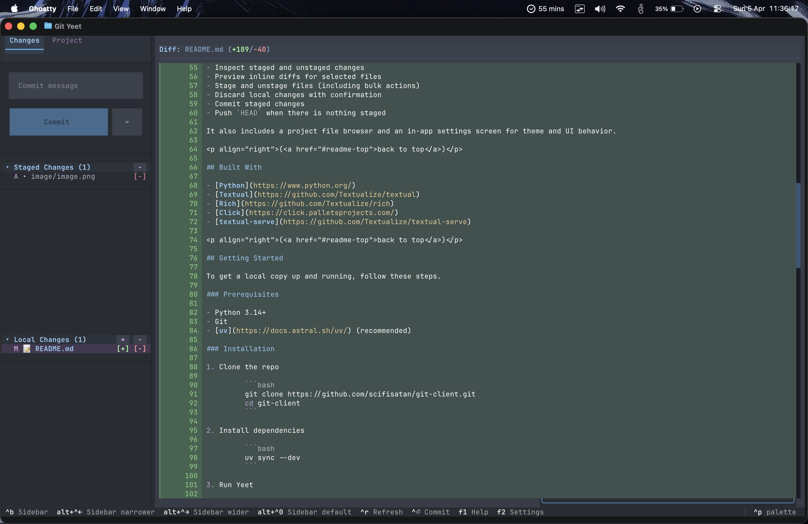
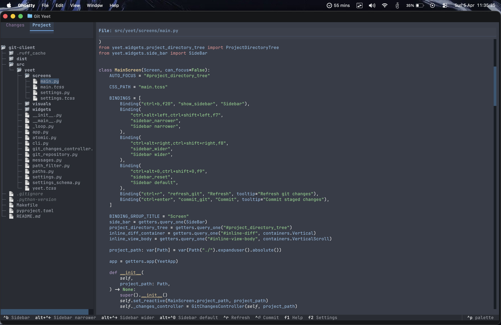

<div align="center">

<h3 align="center">Yeet</h3>

<p align="center">VSCode like git client in your terminal.</p>

<table>
  <tbody>
  <tr>
		<td></td> 
		<td></td>    
  </tr>
  </tbody>
</table>
</div>

## Built With

- [Python](https://www.python.org/)
- [Textual](https://github.com/Textualize/textual)
- [Rich](https://github.com/Textualize/rich)
- [Click](https://click.palletsprojects.com/)

## Getting Started

To get a local copy up and running, follow these steps.

### Prerequisites

- Python 3.14+
- Git
- [uv](https://docs.astral.sh/uv/) (recommended)

### Installation

Install `yeet` in your system:

```bash
uv tool install --from git+https://github.com/scifisatan/yeet.git satan-yeet
```

Then run it inside your repo:

```bash
yeet
```

## Usage

Run in the current directory:

```bash
yeet
```

Open a specific project directory:

```bash
yeet /path/to/repo
```

Serve in a browser:

```bash
yeet serve --host localhost --port 8000
```

## Acknowledgments

Special thanks to [Will McGugan](https://github.com/willmcgugan), creator of [Rich](https://github.com/Textualize/rich) and [Textual](https://github.com/Textualize/textual), for building the ecosystem that made this project possible.

The project [toad](https://github.com/batrachianai/toad) was used as a base to build the features I needed. It also helped me understand how to build using [Textual](https://github.com/Textualize/textual).
